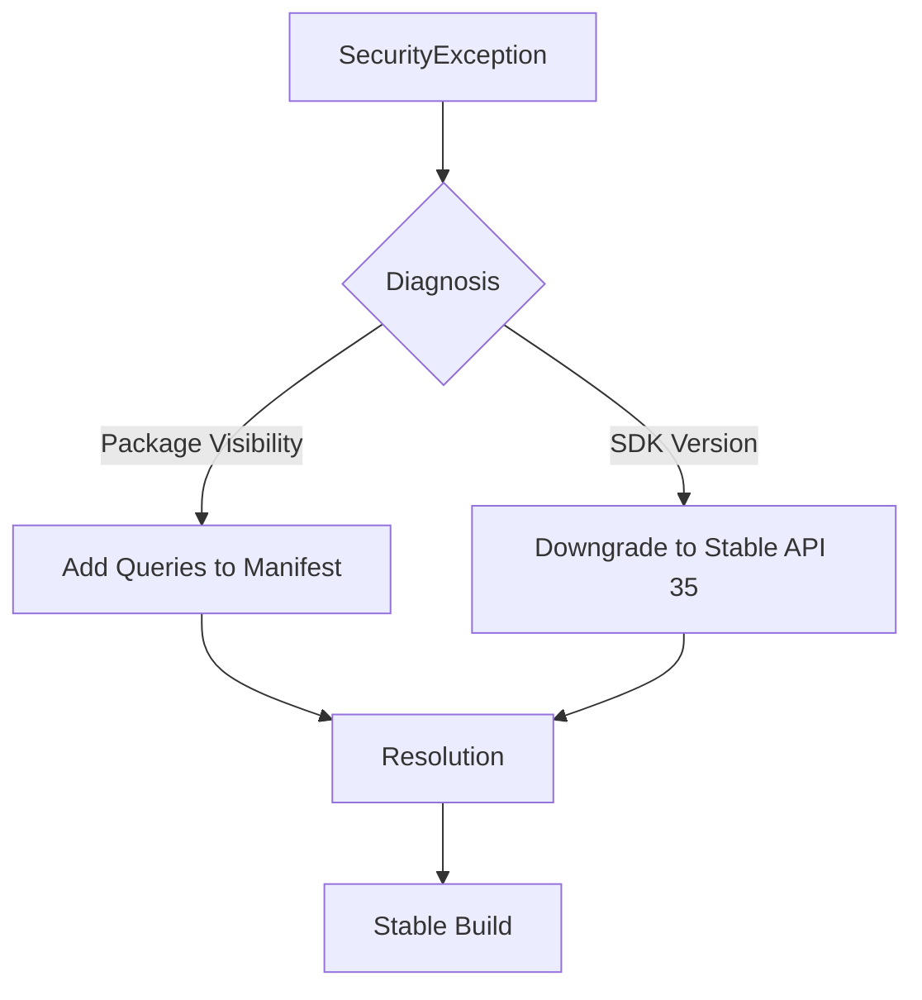

# The Ghost in the Service: A CineVerse Post-Mortem

## The Incident
In the quiet halls of the `CineVerse` development environment, a silent killer emerged. It didn't arrive with a loud crash or a UI glitch. Instead, it whispered through the logs: **"Failed to get service from broker."**

Developers watched in confusion as the `GoogleApiManager` threw a `java.lang.SecurityException`. The culprit? An "Unknown calling package name" claiming to be `com.google.android.gms`. It was as if the application had forgotten its own identity—or rather, the system had refused to recognize the very services it relied upon.

## The Investigation
The trail led to the heart of the project's configuration. We found two critical clues:
1.  **The Frontier SDK:** The project was targeting `compileSdk 36`—the bleeding edge of Android development. While ambitious, this version introduced stricter security protocols that the underlying device's service broker wasn't yet prepared to handle.
2.  **The Invisible Broker:** Since Android 11, apps have been living in a world of "Package Visibility." Without an explicit declaration, `CineVerse` was blind to the presence of Google Play Services, even though they resided on the same device.

## The Resolution
The intervention was swift and surgical.

First, we pulled the project back from the edge, retreating from the experimental `Sdk 36` to the stable ground of **API 35**. This restored the baseline compatibility required for steady communication.

Second, we pierced the veil of package visibility. By inserting a `<queries>` block into the `AndroidManifest.xml`, we gave `CineVerse` the "vision" it needed to recognize its partner, `com.google.android.gms`.

> [!IMPORTANT]
> The `<queries>` element is the modern Android developer's way of saying: "I know this package exists, and I need to talk to it."

## The Aftermath
With the configuration synchronized and the manifest clarified, the "Unknown calling package" error vanished. The broker was found, the service was secured, and the movie journey could continue. The ghost was exorcised.

