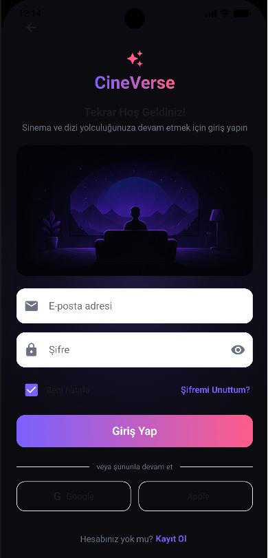
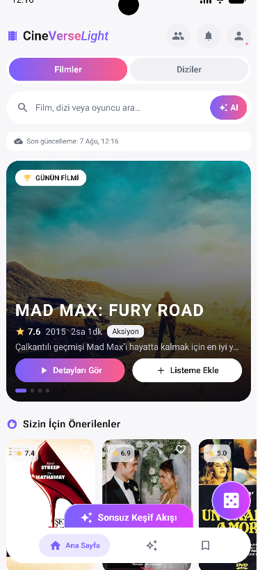
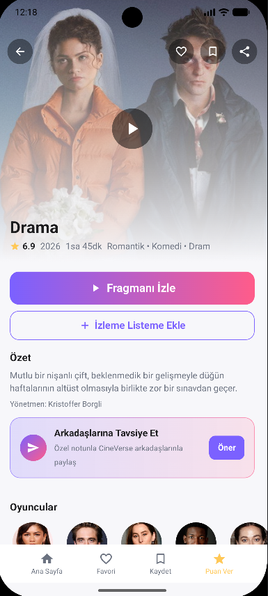
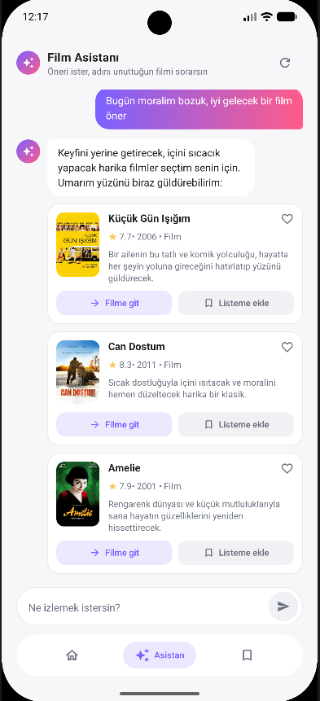
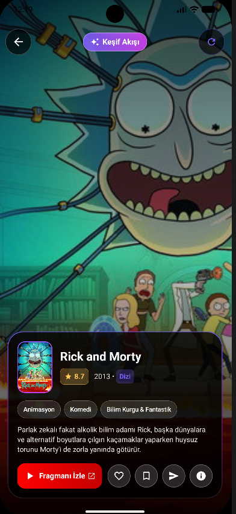
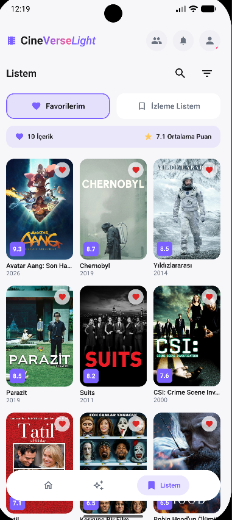
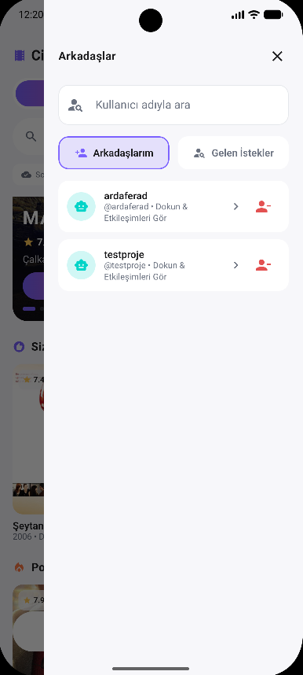
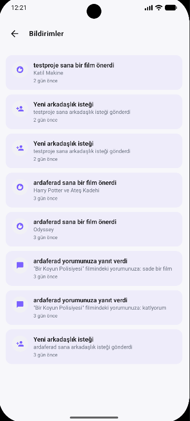

# 📱 CineVerse - Detaylı Uygulama Dokümantasyonu

Bu dokümantasyon, **CineVerse** Android uygulamasının tüm mimarisini, ekranlarını, kullanıcı akışlarını ve arka plan servislerini detaylı olarak açıklamak amacıyla hazırlanmıştır.

Ekran görüntüleri `docs/screenshots/` dizininden çekilmektedir. Kendi ekran görüntülerinizi ilgili dosya isimleriyle koyduğunuzda bu dokümanda otomatik olarak görüntülenecektir.

---

## 📌 İçindekiler
1. [🔐 1. Kimlik Doğrulama Ekranı (Auth Screen)](#-1-kimlik-doğrulama-ekranı-auth-screen)
2. [🏠 2. Ana Sayfa & Keşif (Home Screen)](#-2-ana-sayfa--keşif-home-screen)
3. [🎬 3. Film ve Dizi Detay Ekranı (Media Detail Screen)](#-3-film-ve-dizi-detay-ekranı-media-detail-screen)
4. [🤖 4. Yapay Zeka Asistanı (AI Chat Screen)](#-4-yapay-zeka-asistanı-ai-chat-screen)
5. [📱 5. Reels Keşif Akışı (Reels Screen)](#-5-reels-keşif-akışı-reels-screen)
6. [❤️ 6. Listem & Çevrimdışı Önbellek (My List Screen)](#-6-listem--çevrimdışı-önbellek-my-list-screen)
7. [👥 7. Arkadaşlık & Aktivite Akışı (Friends Screen)](#-7-arkadaşlık--aktivite-akışı-friends-screen)
8. [🔔 8. Bildirimler Ekranı (Notifications Screen)](#-8-bildirimler-ekranı-notifications-screen)
9. [👤 9. Profil & Ayarlar Ekranı (Profile Screen)](#-9-profil--ayarlar-ekranı-profile-screen)
10. [⚙️ 10. Arka Plan Senkronizasyonu & Güvenlik](#-10-arka-plan-senkronizasyonu--güvenlik)

---

## 🔐 1. Kimlik Doğrulama Ekranı (Auth Screen)

### İşlevler ve Teknik Detaylar
* **Firebase Auth Entegrasyonu:** E-posta ve şifre ile güvenli kayıt olma (*Sign Up*) ve giriş yapma (*Sign In*).
* **Parola Sıfırlama:** Unutulan şifreler için e-posta sıfırlama bağlantısı gönderme.
* **Girdi Doğrulama (Validation):** Geçersiz e-posta formatı, kısa şifre ve uyuşmayan şifre alanları için anlık UI geri bildirimi.
* **Bileşenler:** `AuthViewModel`, `AuthUiState`, `FirebaseAuth`.

---

## 🏠 2. Ana Sayfa & Keşif (Home Screen)

### İşlevler ve Teknik Detaylar
* **Trendler ve Banner:** En popüler vizyon filmleri hero carousel biçiminde sergilenir.
* **Akıllı Öneri Motoru (Size Özel):** Kullanıcının geçmiş izleme, arama ve favori sinyallerine dayalı kişiselleştirilmiş film önerileri (`RecommendationRepository`).
* **Tür Filtreleme ve Arama:** Aksiyon, Komedi, Dram vb. türlere göre anlık filtreleme ve arama çubuğu.
* **Çevrimdışı Önbellek:** İnternet yoksa Room veritabanındaki `MovieEntity` ve `TvShowEntity` listeleri gösterilir.

---

## 🎬 3. Film ve Dizi Detay Ekranı (Media Detail Screen)

### İşlevler ve Teknik Detaylar
* **Genişletilmiş Bilgiler:** Yapım yılı, IMDb puanı, süre, özet, türler ve oyuncu kadrosu (*Cast*).
* **Fragman & Medya:** Youtube fragman kartı ve galeri görselleri.
* **Puanlama ve Yorumlar:** 1-5 yıldız arası topluluk derecelendirmesi, spoiler toggle seçeneği ile yorum yazma ve yorum yanıtları (*Replies*).
* **Favori ve İzleme Listesi Butonları:** Çevrimdışı iken basıldığında anında Room DB'ye işlenir ve `PendingActionEntity` olarak senkronizasyon kuyruğuna yazılır.

---

## 🤖 4. Yapay Zeka Asistanı (AI Chat Screen)

### İşlevler ve Teknik Detaylar
* **Google Gemini AI (REST API):** Kullanıcının doğal dilde sorduğu sorulara ("Son 5 yılın en iyi bilim kurgu filmleri hangileri?") akıllı ve hızlı yanıt verir.
* **Çift Modlu Hafıza:** Film ve Dizi modları arasında sohbet geçmişi birbirinden bağımsız korunur.
* **Öneri Kartları:** Asistanın önerdiği filmler sohbet içinde tıklanabilir kartlar olarak görünür.

---

## 📱 5. Reels Keşif Akışı (Reels Screen)

### İşlevler ve Teknik Detaylar
* **Dikey Kaydırılabilir Akış:** TikTok / Shorts benzeri akıcı kaydırma deneyimi (`LazyColumn` / `Pager`).
* **Hızlı Aksiyonlar:** Kart üzerinden anında fragman başlatma, beğendim/beğenmedim işaretleme ve listeye ekleme.
* **Veri Kaynağı:** TMDB API'den çekilen popüler klip ve içerik kombinasyonları (`MovieReelsRepository`).

---

## ❤️ 6. Listem & Çevrimdışı Önbellek (My List Screen)

### İşlevler ve Teknik Detaylar
* **Favoriler & İzleme Listesi Sekmeleri:** İki sekme arasında hızlı geçiş ve sıralama/filtreleme seçenekleri (IMDb Puanı, Uygulama Puanı, Yıl, Başlık).
* **Offline-First:** İnternet bağlantısı olmasa bile Room veritabanından önbelleğe alınan filmler kesintisiz listelenir.
* **Sessiz Senkronizasyon:** İnternet geldiğinde çevrimdışıyken yapılan tüm ekleme/çıkarma işlemleri Firestore ile eşgözlenir.

---

## 👥 7. Arkadaşlık & Aktivite Akışı (Friends Screen)

### İşlevler ve Teknik Detaylar
* **Kullanıcı Arama & İstekler:** Benzersiz kullanıcı adları ile arama yapma, istek gönderme ve gelen istekleri kabul etme/reddetme.
* **Aktivite Akışı:** Arkadaşların son favorilediği, izleme listesine eklediği veya oyladığı yapımların canlı zaman tüneli.
* **Güvenli İşlemler:** Firestore kuralları gereği arkadaş istekleri Supabase Edge Function üzerinden doğrulanarak işlenir.

---

## 🔔 8. Bildirimler Ekranı (Notifications Screen)

### İşlevler ve Teknik Detaylar
* **Bildirim Tipleri:** Yorum yanıtları, arkadaşlık istekleri, istek kabulleri ve önerilen içerikler.
* **Toplu Okundu İşaretleme:** Açılışta okunmamış bildirimler batch sorgusu ile okunmuş sayılır.
* **Firebase Cloud Messaging (FCM):** Cihaza anlık push notification iletimi ve bildirim geçmişi.

---

## 👤 9. Profil & Ayarlar Ekranı (Profile Screen)

### İşlevler ve Teknik Detaylar
* **Kullanıcı İstatistikleri:** Verilen ortalama puan, eklenen favori ve izleme listesi sayıları.
* **Kişiselleştirme:** Avatar değiştirme, kullanıcı adı güncelleme, koyu/açık tema geçişi.
* **Veri Önbellekleme:** Profil bilgileri `UserPreferencesRepository` (DataStore) üzerinde saklandığı için internet bağlantısı yokken de profil anında açılır.

---

## ⚙️ 10. Arka Plan Senkronizasyonu & Güvenlik

* **Room Database:** `cineverse.db` altında `movies`, `saved_movies`, `pending_actions`, `friends`, `watch_history` tabloları.
* **Firestore Security Rules:** `notifications` ve `friends` koleksiyonlarına istemciden doğrudan yazma engellenmiş, sunucu taraflı güvenli mimari kurulmuştur.
* **WorkManager:** Periyodik arka plan güncellemeleri ve çevrimdışı işlem senkronizasyon kontrolcüsü.

---

  <b>CineVerse Documentation</b> • 2026

